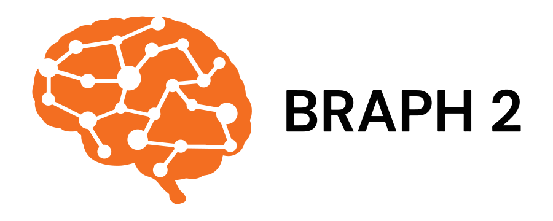
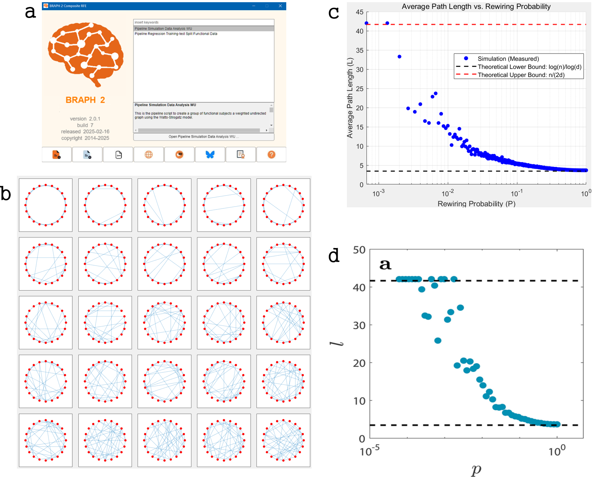
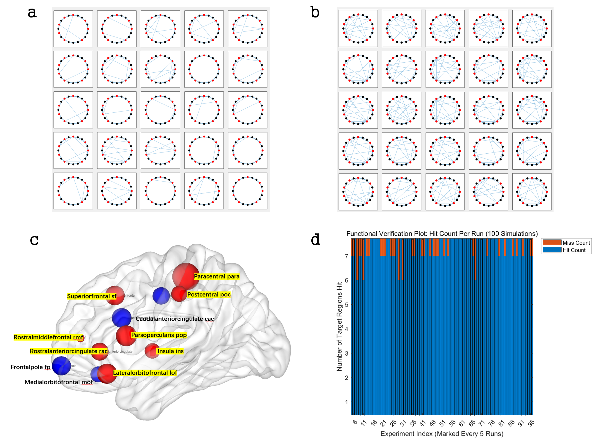
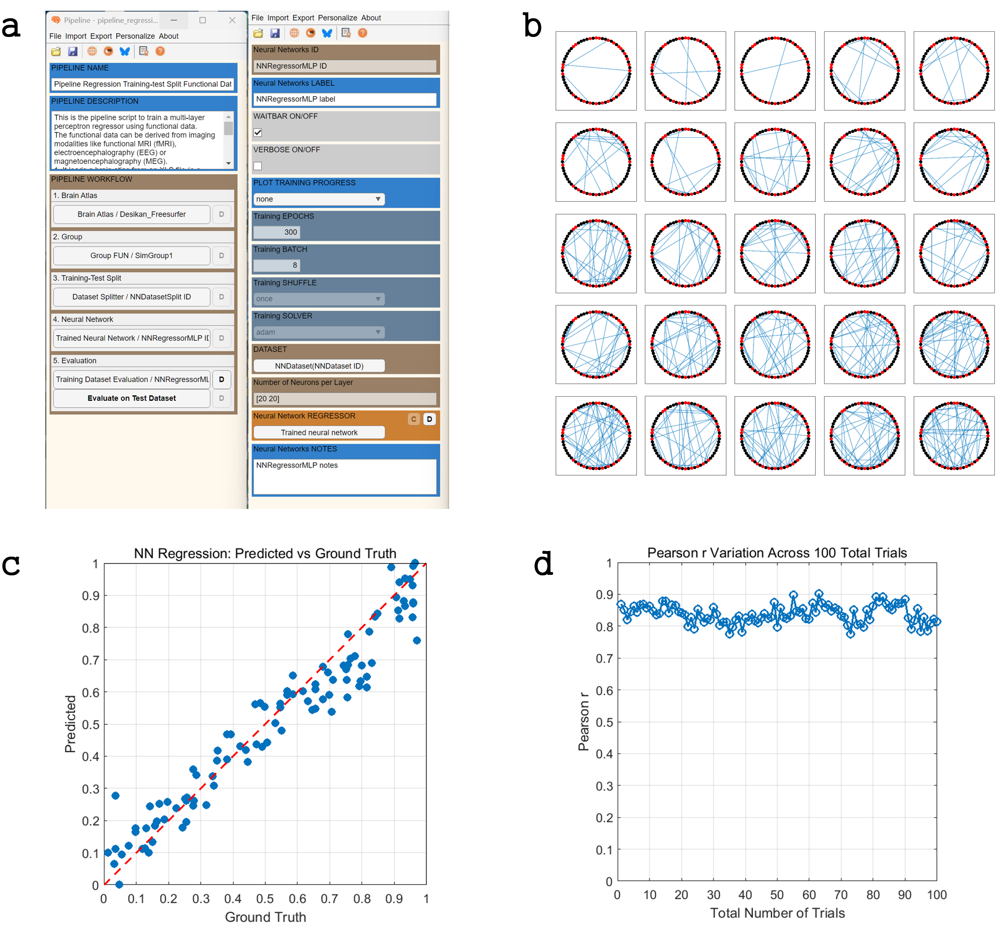
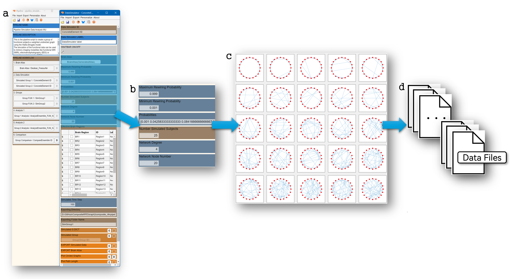

[](https://braph2software.bsky.social)
[](https://twitter.com/braph2software)
[](https://doi.org/10.1371/journal.pone.0178798)
[](https://github.com/braph-software/BRAPH-2/releases)
[](https://doi.org/10.5281/zenodo.14633697)

# BRAPH 2 Watts–Strogatz Model  

The **BRAPH 2 Watts–Strogatz Model** is a BRAPH 2 distribution that uses the **Watts–Strogatz small-world network model** to generate simulated fMRI-like data.  

The goal is to create synthetic datasets that reproduce small-world characteristics, which are widely observed in empirical brain networks.  
This distribution builds on the analytical functionalities of the standard [BRAPH 2](https://github.com/braph-software/BRAPH-2/tree/develop) distribution.  More details on the analysis and tutorials can be found in the main BRAPH 2 repository: [Tutorials](https://github.com/braph-software/BRAPH-2/tree/develop/tutorials).  

## Purpose  

The Watts–Strogatz model is used here to:  
1. **Generate small-world networks** that capture key properties of brain connectivity.  
2. **Produce simulated fMRI data** based on these networks.  
3. **Help researchers verify fMRI analysis pipelines** by testing whether small-worldness is detected and whether user-defined brain regions of interest can be recovered.

## Validation  

The simulated data is validated by comparing the **average path length** of generated networks with the theoretical values expected from Watts–Strogatz graphs.  
For reference, see Argun, A., et al. (2021). *Simulation of Complex Systems*. IOP Publishing. [Link](https://iopscience.iop.org/book/mono/978-0-7503-3843-1)  


> 
> **Validation of the Watts–Strogatz small-world simulation in BRAPH 2** The Watts–Strogatz module generates simulated fMRI networks by rewiring edges in a ring lattice with probability p, producing graphs that exhibit small-world properties. (a) Example BRAPH 2 GUI interface for launching the simulation pipeline. (b) Visualization of networks generated across increasing rewiring probabilities, showing the transition from regular to random structures. (c) Empirical validation of average path length (blue dots) across p, compared with theoretical lower and upper bounds (dashed lines). (d) Independent replication confirms that the simulated path length follows theoretical predictions, demonstrating the validity of the simulation model.

In addition, the simulated dataset is applied to verify two pipelines from the BRAPH 2 standard distribution:  

- [`pipeline_functional_analysis_wu`](https://github.com/braph-software/BRAPH-2/blob/develop/braph2/pipelines/functional/pipeline_functional_analysis_wu.braph2)  
- [`pipeline_regression_cross_validation_functional_wu_measure`](https://github.com/braph-software/BRAPH-2/blob/develop/braph2/pipelines/functional%20NN/pipeline_regression_cross_validation_functional_wu_measure.braph2)


> 
> **Application of simulated data to standard BRAPH 2 graph analysis pipelines** To assess reproducibility, multiple runs of the Watts–Strogatz simulation were performed. (a, b) Networks simulated at different rewiring probabilities, showing variability while preserving global structure. (c) Mapping of hit regions onto the brain surface demonstrates that target ROIs are consistently represented. (d) Verification plot across 100 simulations shows high reproducibility, with the majority of target regions successfully hit across runs.


> 
> **Application of simulated data to standard BRAPH 2 deep learning pipelines** The Watts–Strogatz networks were used to test BRAPH 2’s regression pipelines. (a) GUI interface of the pipeline configuration for training/test splitting and neural network regression. (b) Example simulated networks used as input. (c) Predicted vs. ground truth correlation (Pearson’s r) demonstrates strong model fit. (d) Robustness analysis across 100 trials shows stable performance, confirming that simulated data can be used to validate and benchmark analysis pipelines.


## Software Compilation  

A compiled version of this distribution is provided in the [`braph2wattsstrogatz`](braph2wattsstrogatz) folder.  

If you need to recompile (e.g. after adding new functionalities or pipelines), run the [`braph2genesis`](https://github.com/braph-software/BRAPH-2/blob/develop/braph2genesis.m) function:  

```matlab
braph2genesis('braph2wattsstrogatz_config.m')
```


> 
> **User-friendly configuration and automated simulation workflow BRAPH 2** provides an interactive pipeline to configure, generate, and export Watts–Strogatz simulations. (a) GUI interface of the simulation pipeline with customizable parameters (rewiring probability, degree, node number, subject number). (b) Parameter specification, including the probability vector for multiple simulations. (c) Generated small-world networks across probabilities. (d) Exported data files can be used for downstream analyses and pipeline testing.
